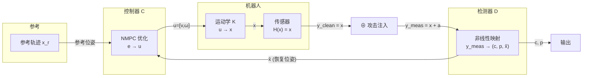
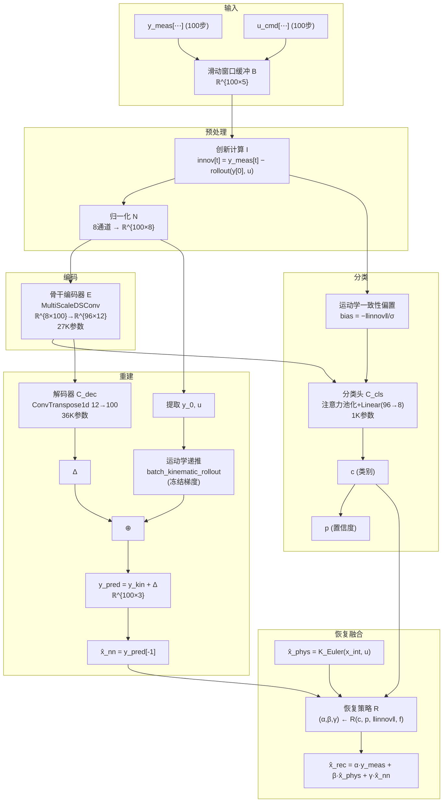
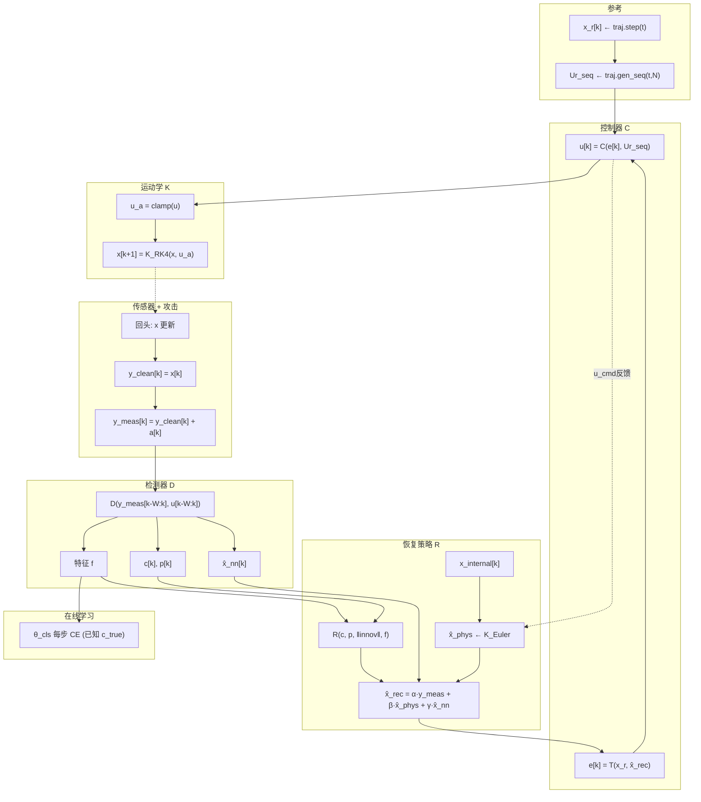

# WMR 传感器攻击检测与恢复系统 — 形式化定义

> 本报告使用数学语言精确描述系统的每个组件，不涉及设计动机、创新点或实验分析。
> 版本: 2026-06-19 v2

---

## 1. 系统总览

### 1.1 三个核心模块

| 模块 | 符号 | 本质 |
|------|------|------|
| **运动学模型** | $\mathcal{K}$ | $u \mapsto x$：控制指令到机器人状态的真值映射 |
| **检测器** | $\mathcal{D}$ | $y_{meas} \mapsto (c, p, \hat{x})$：含攻击测量到类别和状态估计的非线性映射 |
| **控制器** | $\mathcal{C}$ | $(x_r, \hat{x}) \mapsto u$：参考轨迹和状态估计到控制指令的优化映射 |

### 1.2 闭环系统

闭环系统是三个模块的复合：

$$u[k] = \mathcal{C}\big( x_r[k], \; \mathcal{D}( y_{meas}[k-W:k], u[k-W:k-1] ) \big)$$
$$x[k+1] = \mathcal{K}(x[k], u[k])$$
$$y_{meas}[k+1] = \mathcal{H}(x[k+1]) + a[k+1]$$

其中 $\mathcal{H}$ 是传感器映射（本项目 $\mathcal{H}=I$ 恒等），$a[k]$ 是攻击信号。

攻击信号 $a$ 仅在传感器输出后、检测器输入前叠加：

$$y_{meas}[k] = \underbrace{x[k]}_{\text{真值}} + \underbrace{a[k]}_{\text{攻击}}$$

检测器从 $y_{meas}$ 估计出 $\hat{x}$。控制器用 $\hat{x}$ 而非真实 $x$ 计算控制指令：

$$X_e = \text{Transform}(x_r, \hat{x}), \quad u = \mathcal{C}(X_e, u_r)$$

这就是检测-控制耦合的来源——估计误差 $\|\hat{x} - x\|$ 直接影响控制品质。

---

## 2. 运动学模型 $\mathcal{K}$

### 2.1 定义

运动学模型 $\mathcal{K}$ 是一个**确定性输入-状态映射**：

$$\mathcal{K}: \;\; u[k] \in \mathbb{R}^2 \;\mapsto\; x[k+1] \in \mathbb{R}^3$$

其中 $u[k] = [v[k], \omega[k]]^T$（线速度、角速度），$x[k] = [x_h[k], y_h[k], \theta_h[k]]^T$（前端位姿）。

### 2.2 连续形式

前端位姿运动学方程：

$$\dot{x} = \mathcal{F}(x, u) = \begin{bmatrix} \dot{x}_h \\ \dot{y}_h \\ \dot{\theta}_h \end{bmatrix} = \begin{bmatrix} \cos\theta_h & -\alpha\sin\theta_h \\ \sin\theta_h & \alpha\cos\theta_h \\ 0 & 1 \end{bmatrix} \begin{bmatrix} v \\ \omega \end{bmatrix}$$

其中 $\alpha = 0.17$ m 是前端偏置距离（机器人几何中心到前端控制点的距离）。

### 2.3 离散形式（用于仿真）

$$\mathcal{K}_{\text{RK4}}(x[k], u[k]) = x[k] + \frac{T_s}{6}(k_1 + 2k_2 + 2k_3 + k_4)$$

其中 $k_1, k_2, k_3, k_4$ 是标准 RK4 中间步。$T_s = 0.05$ s 是采样周期。

这是仿真中机器人状态更新的真实动力学。

### 2.4 欧拉形式（用于检测器内部）

$$\mathcal{K}_{\text{Euler}}(x[k], u[k]) = x[k] + T_s \cdot \mathcal{F}(x[k], u[k])$$

用于检测器内部的两个场景：
1. 每步死推算：$\hat{x}_{phys} = \mathcal{K}_{\text{Euler}}(x_{internal}, u)$
2. 窗口创新计算：$y_{kin}[t] = \mathcal{K}_{\text{Euler}}(y_{kin}[t-1], u[t-1])$

欧拉近似引入 $O(T_s^2)$ 截断误差（约 0.0025/步），100 步窗口累积约 0.25，对分类任务可接受。

### 2.5 控制约束

$$u_{clamped} = \text{clip}(u, \; -u_{max}, \; u_{max}), \quad u_{max} = [0.3, 1.76]^T$$
$$x_{clamped} = \text{clip}(x_{1:2}, \; -2.5, \; 2.5)$$

### 2.6 误差动力学（控制器 $\mathcal{C}$ 的预测模型）

定义本体坐标系下的跟踪误差 $e = [e_x, e_y, e_\theta]^T$：

$$e = \mathcal{T}(x_r, x) = \begin{bmatrix} \cos x_\theta & \sin x_\theta & 0 \\ -\sin x_\theta & \cos x_\theta & 0 \\ 0 & 0 & 1 \end{bmatrix} (x_r - x)$$

误差的连续时间动力学：

$$\dot{e} = \mathcal{G}(e, u, u_r) = \underbrace{\begin{bmatrix} v_r\cos e_\theta \\ v_r\sin e_\theta \\ \omega_r \end{bmatrix}}_{f(e, u_r)} + \underbrace{\begin{bmatrix} -1 & e_y \\ 0 & -e_x-\alpha \\ 0 & -1 \end{bmatrix}}_{G(e)} u$$

该动力学用于 NMPC 的预测模型（RK4 离散化）。

---

## 3. 控制器 $\mathcal{C}$

### 3.1 定义

控制器 $\mathcal{C}$ 是一个**优化映射**：

$$\mathcal{C}: \; (e[k] \in \mathbb{R}^3, \; U_r[k] \in \mathbb{R}^{2 \times N}) \;\mapsto\; u[k] \in \mathbb{R}^2$$

将当前跟踪误差和未来 $N$ 步参考指令映射为当前控制指令。

### 3.2 优化问题

$$\mathcal{C}(e[k], U_r[k]) = u^*_{0}$$

其中 $\{u^*_0, \dots, u^*_{N-1}\}$ 是最优控制序列的首步，求解以下问题：

$$\min_{\{u_i\}_{i=0}^{N-1}} \; \sum_{i=1}^{N} e_i^T Q e_i + \sum_{i=0}^{N-1} \Delta u_i^T R \Delta u_i$$

s.t.

$$e_{i+1} = \text{RK4}_{\mathcal{G}}(e_i, u_i, u_{r,i}), \quad i=0,\dots,N-1$$
$$e_0 = e[k] \quad (\text{初始条件：当前跟踪误差})$$
$$|v_i|/v_{max} + |\omega_i|/\omega_{max} \leq 1, \quad i=0,\dots,N-1 \quad (\text{菱形约束})$$
$$|e_{x,i}|, |e_{y,i}| \leq x_{bound}, \quad i=1,\dots,N \quad (\text{状态约束})$$

### 3.3 参数

| 符号 | 值 | 含义 |
|------|:--:|------|
| $N$ | 30 | 预测步长（1.5s） |
| $Q$ | $\text{diag}(0.15, 0.15, 0.01)$ | 状态权重 |
| $R$ | $\text{diag}(0.00125, 0.00125)$ | 控制增量权重 |
| $v_{max}$ | 0.3 m/s | 线速度上限 |
| $\omega_{max}$ | 1.76 rad/s | 角速度上限 |

### 3.4 求解器

基于 CasADi Opti + IPOPT 实现。编译为 `.casadi` 文件，首次运行编译后持久化。

---

## 4. 检测器 $\mathcal{D}$

### 4.1 定义

检测器 $\mathcal{D}$ 是一个**带记忆的非线性映射**：

$$\mathcal{D}: \; (y_{meas}[\cdot], u[\cdot]) \;\mapsto\; (c, p, \hat{x}_{nn}, f)$$

其中 $\mathcal{D}$ 维持内部滑动窗口缓冲区 $\mathcal{B} \in \mathbb{R}^{W \times 5}$（$W=100$，存储最近 $W$ 步的 $[y_{meas}(3), u(2)]$）。

输出：
- $c \in \{0,\dots,7\}$ — 攻击类别（A0-A7）
- $p \in [0,1]$ — 分类置信度
- $\hat{x}_{nn} \in \mathbb{R}^3$ — 解码器重建的干净位姿
- $f \in \mathbb{R}^{12 \times 96}$ — 编码器输出特征（用于策略学习）

### 4.2 检测器内部结构

检测器内部包含一系列固定和可训练的计算步骤，按执行顺序列出：

#### 4.2.1 窗口锚定创新计算（固定函数）

从缓冲区 $\mathcal{B}$ 计算：

$$\text{innov}[t] = y_{meas}[t] - \text{rollout}(y_{meas}[0], u[0:t]), \quad t=0,\dots,W-1$$

其中 $\text{rollout}$ 使用欧拉运动学 $\mathcal{K}_{\text{Euler}}$ 执行 $W-1$ 步递推。

#### 4.2.2 归一化（固定函数）

$$\tilde{y} = (y_{meas} - \mathbf{m}_y) \oslash \mathbf{s}_y$$
$$\tilde{i} = (\text{innov} - \mathbf{m}_{innov}) \oslash \mathbf{s}_{innov}$$
$$\tilde{u} = u \oslash \mathbf{c}_{max}$$

堆叠：$\tilde{x} = [\tilde{y}, \tilde{i}, \tilde{u}] \in \mathbb{R}^{W \times 8}$

#### 4.2.3 骨干编码器（可训练，冻结）

$$\mathcal{E}: \; \tilde{x} \in \mathbb{R}^{B \times 100 \times 8} \mapsto f \in \mathbb{R}^{B \times 12 \times 96}$$

三个膨胀深度可分离卷积块串联，通道 $8 \to 32 \to 64 \to 96$，时序 $100 \to 50 \to 25 \to 12$。参数量约 27K，预训练后冻结。

#### 4.2.4 分类头（可训练，在线解冻）

$$\mathcal{C}_{cls}: \; (f, \text{innov}) \mapsto (c, p)$$

1. 运动学一致性偏置：$\text{bias}[j] = -\|\text{innov}[t_{idx}(j)]\| / \sigma$
2. 注意力池化：$\text{scores} = (f \cdot q) / \sqrt{d} + \alpha \cdot \text{bias}$
3. $\mathbf{w} = \text{softmax}(\text{scores})$, $f_{pooled} = \sum \mathbf{w}_j f_j$
4. $f_{pooled} \to \text{LN} \to \text{Dropout} \to \text{Linear}(96,8) \to \mathbf{z}_{cls}$
5. $c = \arg\max \mathbf{z}_{cls}$, $p = \max \text{softmax}(\mathbf{z}_{cls})$

参数量约 1K。可被选择性地在线更新（见第 6 节）。

#### 4.2.5 解码器（可训练，冻结）

仅在 $p \geq 0.5$ 且 $c \neq \text{A0}$ 时运行。

$$\mathcal{C}_{dec}: \; f \mapsto \hat{x}_{nn} \in \mathbb{R}^3$$

1. $f \xrightarrow{\text{ConvTranspose1d}} \Delta \in \mathbb{R}^{B \times 100 \times 3}$（上采样 12→100）
2. $y_{kin} = \text{batch\_rollout}(y_0, u)$（运动学递推，冻结梯度）
3. $y_{pred} = y_{kin} + \Delta$
4. $\hat{x}_{nn} = y_{pred}[-1, :]$（窗口最后一步）

参数量约 36K。

### 4.3 检测器总复合映射

$$\mathcal{D}(y_{meas}[\cdot], u[\cdot]) = \begin{cases}
(\mathcal{C}_{cls} \circ \mathcal{N} \circ \mathcal{I} \circ \mathcal{B})(\cdot) & \text{如果窗口未就绪或无攻击} \\
(\mathcal{C}_{cls} \circ \mathcal{E} \circ \mathcal{N} \circ \mathcal{I} \circ \mathcal{B})(\cdot), \; \hat{x} = (\mathcal{C}_{dec} \circ \mathcal{E} \circ \mathcal{N} \circ \mathcal{I} \circ \mathcal{B})(\cdot) & \text{如果窗口就绪且检测到攻击}
\end{cases}$$

其中 $\mathcal{B}$=缓冲，$\mathcal{I}$=创新计算，$\mathcal{N}$=归一化，$\mathcal{E}$=编码器。

### 4.4 恢复融合

检测器输出 $\hat{x}_{nn}$ 与两个额外信号融合形成最终位姿估计：

$$\hat{x}_{rec} = \alpha \cdot y_{meas} + \beta \cdot \hat{x}_{phys} + \gamma \cdot \hat{x}_{nn}$$

其中 $\hat{x}_{phys} = \mathcal{K}_{\text{Euler}}(x_{internal}, u)$ 来自检测器内部的独立运动学状态 $x_{internal}$。

$(\alpha, \beta, \gamma)$ 由恢复策略决定（见第 5 节）。

---

## 5. 恢复策略

### 5.1 定义

恢复策略 $\mathcal{R}$ 是一个**决策映射**：

$$\mathcal{R}: \; (c, p, \|\text{innov}\|, f) \;\mapsto\; (\alpha, \beta, \gamma) \in \Delta^2$$

其中 $\Delta^2 = \{\alpha,\beta,\gamma \geq 0, \alpha+\beta+\gamma=1\}$ 是二维单纯形。

### 5.2 固定策略实现

**P0 — HardSwitch**：

$$\mathcal{R}_{P0} = \begin{cases} (1,0,0) & p < 0.5 \text{ 或 } c = \text{A0} \\ (0,0,1) & p \geq 0.5, c \neq \text{A0}, \hat{x}_{nn} \text{ 可用} \\ (0,1,0) & \text{其他} \end{cases}$$

**P1 — ConfidenceBlend**：

$$\mathcal{R}_{P1} = \begin{cases} (1,0,0) & p < 0.5 \text{ 或 } c = \text{A0} \\ (1-\min(p, 0.95), \; 0, \; \min(p, 0.95)) & p \geq 0.5, c \neq \text{A0} \end{cases}$$

**P2 — InnovationGated**：

$$g = \exp(-\|\text{innov}\|^2 / \sigma^2), \quad w = \min(p, 0.95)$$
$$\mathcal{R}_{P2} = \big((1-w)g + (1-g), \; 1-\alpha-\gamma, \; w \cdot g\big)$$

**P3 — PhysicsFirst**：

$$\mathcal{R}_{P3} = (0, 0, 1)$$

**P4 — 在线学习策略**（见第 6 节）：

$$\mathcal{R}_{P4} = \text{argmax}\; \pi_\phi(s) \text{（评估）或 } \text{Categorical}(\pi_\phi(s)/\tau) \text{（训练）}$$

其中状态 $s$ 包含编码器特征、置信度等上下文信息。

---

## 6. 在线学习（仅 P4 策略）

### 6.1 可学习参数

整个系统中唯一可在线更新的参数是：

| 参数 | 所属 | 数量 | 更新方式 |
|------|------|:---:|---------|
| $\phi$ | 策略网络 $\pi_\phi: \mathbb{R}^{106} \to \Delta^2$ | ~3.5K | REINFORCE（集级） |
| $\theta_{cls}$ | 分类头 $\mathcal{C}_{cls}$ | ~1K | 监督 CE（步级） |

其他所有参数（backbone ~27K、解码器 ~36K）冻结。

### 6.2 策略学习

策略网络 $\pi_\phi$ 是一个两层 MLP（106→32→3）。

状态：$s = [\text{pool}(f) \in \mathbb{R}^{96}, \; p \in [0,1], \; \|\text{innov}\| \in \mathbb{R}, \; \text{onehot}(c) \in \mathbb{R}^8]$

动作：$a \in \{0, 1, 2\}$ 分别对应 $(\alpha,\beta,\gamma)$ 取三个角点。

奖励：$r[k] = -\|\underbrace{y_{meas}[k+1] - \mathcal{K}_{\text{Euler}}(\hat{x}_{rec}[k], u[k])}_{\text{innov}[k+1]}\|^2 - 0.1 \cdot \|e[k]\|^2$

更新：每集子采样 128 步，REINFORCE with baseline。

### 6.3 分类头校准

每步即时监督更新：

$$\theta_{cls} \leftarrow \theta_{cls} - \eta_{cls} \nabla \text{CE}(\mathcal{C}_{cls}(f, \text{innov}), \; c_{true})$$

其中 $c_{true}$ 是仿真中已知的真实攻击标签。

---

## 7. 攻击模型

### 7.1 攻击作为传感器通道上的加性/变换算子

攻击 $a$ 作用在传感器输出 $y_{clean} = x$ 上，产生 $y_{meas}$：

$$y_{meas}[k] = \mathcal{A}_t(y_{clean}[k]), \quad t \geq t_{onset}$$

其中 $\mathcal{A}_t: \mathbb{R}^3 \to \mathbb{R}^3$ 是攻击算子，具体形式依攻击类型而定：

| ID | 算子 | 参数 |
|:--:|------|------|
| A0 | $\mathcal{A}(y) = y$ | — |
| A1 | $\mathcal{A}(y) = y + \mathbf{b}$ | $\mathbf{b}=[0.15,-0.12,0.10]^T$ |
| A2 | $\mathcal{A}_t(y) = y + \mathbf{a}\sin(2\pi ft)$ | $A=0.12, f=0.8\text{Hz}$ |
| A3 | $\mathcal{A}_t(y) = y + \mathbf{r}(t-t_{onset})$ | $\mathbf{r}=[0.020,0.016,0.010]^T$ |
| A4 | $\mathcal{A}_t(y) = \text{replay}(t)$ | 回放攻击前录制数据 |
| A5 | $\mathcal{A}_t(y) = \mathbf{0} \text{ or } y_{last}$ (Markov) | $p_{gf}=0.02, p_{fg}=0.08$ |
| A6 | $\mathcal{A}(y) = \text{diag}([1.4,0.6,-0.5]) \cdot y$ | 乘性缩放 |
| A7 | $\mathcal{A}_t(y) = y(t_{onset})$ | 冻结在攻击时刻值 |

### 7.2 时序

$$t_{onset} \sim \mathcal{U}(5, 30)\text{s}$$

每次仿真独立采样。

---

## 8. 数据管线

| 步骤 | 输入 → 输出 | 执行模块 |
|:----:|------------|---------|
| 1 | 随机参数 → 480 个 .npz 开环仿真文件 | `generate_dataset.py` |
| 2 | .npz → 滑动窗口 (100步, stride=1) → 归一化 → .npy | `preprocess_data.py` |
| 3 | .npy → KAD 检测器预训练 (CE + MSE) | `detector/train.py` |

开环仿真中无检测器介入（$\hat{x}_{rec} = y_{meas}$ 直送 NMPC），确保训练数据不包含检测器反馈。

---

## 9. 闭环仿真（完整链路）

每步 $k$ 的完整计算序列：

---

*报告结束。版本 2026-06-19 v2。核心三要素：运动学 $\mathcal{K}$、检测器 $\mathcal{D}$、控制器 $\mathcal{C}$。*
